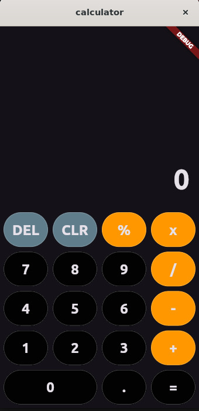

# Calculator

A simple, cross-platform calculator app built with Flutter.

This repository contains a small demonstration calculator with a clean UI and basic arithmetic operations. It’s designed as a learning/example project and a starting point for extending functionality (history, parentheses, scientific functions, theming, etc.).

## Features

- Basic arithmetic: add, subtract, multiply, divide
- Clear and backspace operations
- Responsive layout that works on mobile, web and desktop
- Minimal, easy-to-read code suitable for learning Flutter layout and state handling

## Screenshot



## Getting started

These instructions will get you a copy of the project up and running on your local machine for development and testing.

### Prerequisites

- Flutter SDK (stable channel). Install from https://flutter.dev/docs/get-started/install
- A device/emulator or desktop target (Linux/macOS/Windows) or a browser for web

Verify your setup with:

```bash
flutter --version
flutter doctor
```

### Install dependencies

From the project root run:

```bash
flutter pub get
```

## Running the app

Run on the default connected device (mobile emulator, desktop, or web):

```bash
flutter run
```

Run on a specific device (examples):

```bash
# Run on Android emulator or device
flutter run -d android

# Run on iOS simulator or device
flutter run -d ios

# Run on Chrome (web)
flutter run -d chrome

# Run on Linux desktop
flutter run -d linux
```

## Build release artifacts

Examples to produce platform-specific builds:

```bash
# Android APK
flutter build apk --release

# iOS (requires macOS & Xcode)
flutter build ios --release

# Web
flutter build web --release

# Linux desktop
flutter build linux --release
```

## Tests

Run unit & widget tests with:

```bash
flutter test
```

This project includes a basic widget test in `test/widget_test.dart`.

## Project structure

- `lib/` — main application code
	- `main.dart` — app entrypoint
	- `calculator_screen.dart` — main UI
	- `button_values.dart` — button labels/values
- `test/` — tests
- `android/`, `ios/`, `linux/`, `macos/`, `windows/`, `web/` — platform folders generated by Flutter

## Customization and extension ideas

- Add history of calculations
- Support parentheses and more advanced math functions (sin, cos, log)
- Add theming (dark/light) and accessibility improvements
- Persist user preferences

## Contributing

Contributions are welcome! Please fork the repo and open a pull request.

```bash
git clone https://github.com/Eyobed9/Flutter_Calculator.git
git checkout -b feature/feature-name
```

---

## License
This project is licensed under the [MIT License](./LICENSE).

## Contact


For questions, reach out at [eyobedteshome@gmail.com] → [eyobedteshome@gmail.com](mailto:eyobedteshome@gmail.com) or connect via [LinkedIn](https://www.linkedin.com/in/eyobed-d-249634230/).

